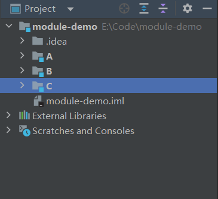
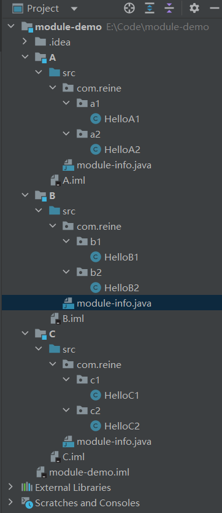

# Java模块化
## 一、模块系统简介

如果把Java 8比作单体应用，那么引入模块系统之后，从Java 9开始，Java 就华丽的转身为微服务。模块系统，项目代号 Jigsaw，最早于2008年8月提出（比Martin Fowler 提出微服务还早6年），2014年跟随Java 9正式进入开发阶段，最终跟随Java 9发布于2017年9月。

那么什么是模块系统？官方的定义是**A uniquely named， reusable group of related packages， as well as resources （such as images and XML files） and a module descriptor**．如图-1 所示，模块的载体是 jar 文件，一个模块就是一个jar 文件，但相比于传统的jar 文件，模块的根目录下多了一个 `module-info.class` 文件，也即 `module descriptor`。 `module descriptor` 包含以下 信息：

-  模块名称 
-  依赖哪些模块 
-  导出模块内的哪些包（允许直接 import 使用） 
-  开放模块内的哪些包（允许通过Java反射访问） 
-  提供哪些服务 
-  依赖哪些服务 

## 二、演示（前期准备）

新建三个项目（IDEA中创建一个空项目，在空项目中创建3个模块（module）），如下图



给每一个子模块创建类，内容如下（模板），并添加`module-info.java`文件

```java
package com.reine.xx;

/**
 * @author reine
 * 2022/8/7 17:03
 */
public class HelloXx {
    public void hello(){
        System.out.println("Hello, I'm Xx");
    }
}
```

工程结构如下



## 三、模块化语法（引入与导出）

```java
module XX{
    exports ${package}; // 将对应包名中的所有类暴露
    exports ${package} to X, Y, Z; // 将对应包名中的所有类暴露给X，Y，Z模块
    requires ${module}; // 导入对应模块
    requires transitive ${module}; // 导入对应模块，如果有模块依赖了B，则该模块同时可以使用A（传递依赖）
}
```

如果使用IDEA，则需要在对应项目中的`.iml`文件中注明依赖的模块，如

```xml
    <orderEntry type="module" module-name="A" />
```

##### 例1（模块引入与导出）

模块A中的`module-info.java`文件

```java
module A {
    exports com.reine.a1 to B; // 导出模块A中的包com.reine.a1给模块B使用
    exports com.reine.a2; // 导出模块A中的包com.reine.a2
}
```

模块B中的`module-info.java`文件

```java
module B {
    requires java.base; // 此模块自动导入，可以不写
    requires A; // 在B模块中导入A模块
}
```

`main`方法

```java
package com.reine.main;

import com.reine.a1.HelloA1;

public class Main {
    public static void main(String[] args) {
        new HelloA1().hello();
    }
}
```

模块C中的`module-info.java`文件

```java
module C {
    requires A;
}
```

`main`方法

```java
package com.reine.main;

import com.reine.a1.HelloA1; // 编译报错
import com.reine.a2.HelloA2;

/**
 * @author reine
 * 2022/8/7 17:23
 */
public class Main {
    public static void main(String[] args) {
        new HelloA1().hello();// 编译报错Package 'com.reine.a1' is declared in module 'A', which does not export it to module 'C'
        new HelloA2().hello();
    }
}
```

##### 例2（模块B传递依赖模块A）

模块B中的`module-info.java`文件

```java
module B {
    requires java.base; // 此模块自动导入，可以不写
    requires transitive A; // 在B模块中导入A模块（传递依赖）
}
```

模块C中导入模块B

```java
module C {
    requires B;
}
```

模块C中的`main`方法

```java
package com.reine.mainc;

import com.reine.a1.HelloA1;
import com.reine.a2.HelloA2;

public class Main {
    public static void main(String[] args) {
        new HelloA1().hello();
        new HelloA2().hello();
    }
}
```

## 四、模块化语法（反射访问）

```java
// 如果在module前加open，则表示此模块中所有包下的类都可以通过反射访问
[open] module XX{
    // 当同一个包同时被exports 和opens 修饰时，opens生效
    exports ${package}; // 将对应包名中的所有类暴露
    exports ${package} to X, Y, Z; // 将对应包名中的所有类暴露给X，Y，Z模块
    opens ${package}; // 允许其他模块使用反射方式访问此包中所有方法
    opens ${package} to X, Y, Z; // 允许X, Y, Z模块使用反射方式访问此包中所有方法
}
```

##### 例3（将模块A中HelloA1的hello方法的访问修饰符改为private）

```java
package com.reine.a1;

public class HelloA1 {
    private void hello() {
        System.out.println("Hello, I'm A1");
    }
}
```

使用exports导出`com.reine.a1`

```java
module A {
    exports com.reine.a1; // 导出模块A中的包com.reine.a1
}
```

B中使用`requires A;`导入模块A，使用反射调用hello方法（**报错**`**java.lang.reflect.InaccessibleObjectException**`）

```java
package com.reine.mainb;

import java.lang.reflect.Method;

public class Main1 {
    public static void main(String[] args) {
        try {
            Class<?> cls = Class.forName("com.reine.a1.HelloA1");
            Method hello = cls.getDeclaredMethod("hello");
            hello.setAccessible(true);// 报错 Caused by: java.lang.reflect.InaccessibleObjectException: Unable to make private void com.reine.a1.HelloA1.hello() accessible: module A does not "opens com.reine.a1" to module B
            hello.invoke(cls.getDeclaredConstructor().newInstance(), null);
        } catch (Exception e) {
            throw new RuntimeException(e);
        }
    }
}
```

##### 例4 （将模块A中HelloA2的hello方法的访问修饰符改为private）

```java
package com.reine.a2;

public class HelloA2 {
    private void hello(){
        System.out.println("Hello, I'm A2");
    }
}
```

使用opens导出`com.reine.a1`**【对比例3】**

```java
module A {
    opens com.reine.a2; // 依赖该模块的其他项目可以使用反射访问这个包下的内容
}
```

B中使用`requires A;`导入模块A，使用反射调用hello方法（**通过**）

```java
package com.reine.mainb;

import java.lang.reflect.Method;

public class Main2 {
    public static void main(String[] args) {
        try {
            Class<?> cls = Class.forName("com.reine.a2.HelloA2");
            Method hello = cls.getDeclaredMethod("hello");
            hello.setAccessible(true); // 通过
            hello.invoke(cls.getDeclaredConstructor().newInstance(), null);
        } catch (Exception e) {
            throw new RuntimeException(e);
        }
    }
}
```

## 五、模块化语法（服务提供及使用）

```java
module XX{
    provides ${interface} with ${class}, ${class}; // 将对应服务（接口）的具体实现类（可以有多个）提供给外部使用
    uses ${interface} // 使用服务，前提必须引入服务所在的包
}
```

##### 例5 （模块B使用模块A定义的服务）

模块A服务类`Print.java`

```java
package com.reine.service;

public interface Print {
    void hello();
}
```

具体实现类`HelloA1`和`HelloA2`

```java
package com.reine.a1;

import com.reine.service.Print;

public class HelloA1 implements Print {
    public void hello() {
        System.out.println("Hello, I'm A1");
    }
}
```

```java
package com.reine.a2;

import com.reine.service.Print;

/**
 * 没有无参构造函数
 */
public class HelloA2 implements Print {

    private String name;

    public HelloA2(String name) {
        this.name = name;
    }

    public void hello() {
        System.out.println("Hello, I'm " + name);
    }

    /**
     * 固定函数名
     */
    public static Print provider() {
        return new HelloA2("reine");
    }
}
```

`module-info.java`

```java
module A {
    exports com.reine.service;
    provides com.reine.service.Print with com.reine.a1.HelloA1; // 将具体服务HelloA1提供出去
}
```

模块B`module-info.java`使用`Print`服务

```java
module B {
    requires A; 
    uses com.reine.service.Print;
}
```

`main`方法

```java
package com.reine.mainb;

import com.reine.service.Print;

import java.util.ServiceLoader;

public class Main3 {
    public static void main(String[] args) {
        ServiceLoader<Print> prints = ServiceLoader.load(Print.class);
        for (Print print : prints) {
            print.hello(); // 输出 Hello, I'm A1
        }
    }
}
```

## 六、命令行选项（模块相关）

```shell
java --list-modules # 查看所有jdk自带的模块
java --describe-module ${module} # 查看指定模块下的模块化消息
```
