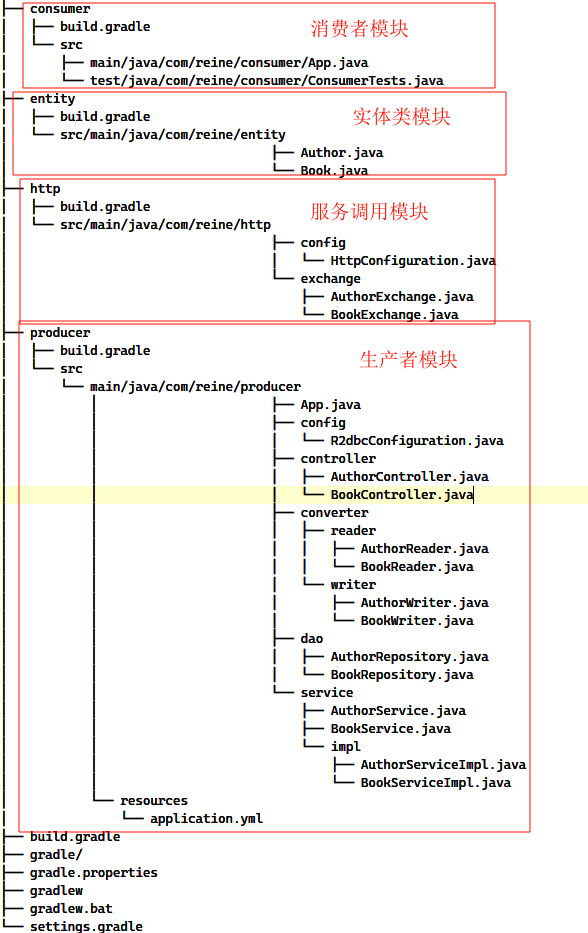

# Gradle 多模块项目构建

[演示项目具体代码](https://github.com/reine-ishyanami/article/tree/master/code/gradle-multi-module)

1. 演示项目的目录结构

   

2. 父项目 `gradle.properties` 用于定义一些用在 `build.gradle` 中的属性

   ```properties
   group=com.reine
   version=0.0.1
   springbootVersion=3.2.1
   springManagementVersion=1.1.4
   javaVersion=21
   r2dbcMysqlVersion=1.0.5
   lombokVersion=1.18.30
   ```

3. 父项目 `build.gradle`，用于定义一些全局配置

   ```groovy
   plugins {
     id 'java'
     id "java-library"
     id 'org.springframework.boot' version "${springbootVersion}"
     id 'io.spring.dependency-management' version "${springManagementVersion}"
   }
   
   // 为所有模块定义，包括自身
   allprojects {
     apply plugin: "java"
   
     java {
         sourceCompatibility = "${javaVersion}"
         targetCompatibility = "${javaVersion}"
     }
   
     repositories {
         mavenCentral()
     }
   
     tasks.withType(JavaCompile).configureEach {
         options.encoding = 'UTF-8'
     }
   }
   
   // 为所有子模块定义
   subprojects {
     dependencies {
         annotationProcessor "org.projectlombok:lombok:${lombokVersion}"
         compileOnly "org.projectlombok:lombok:${lombokVersion}"
     }
   }
   ```

4. 父项目 `setting.gradle`

   ```groovy
   rootProject.name = 'gradle-multi-module'
   include 'producer'
   include 'entity'
   include 'consumer'
   include 'http'
   ```

5. `entity` 模块的 `build.gradle`

   ```groovy
   apply plugin: "org.springframework.boot"
   apply plugin: "io.spring.dependency-management"
   
   dependencies {
   //    starter依赖可以不引入
   //    implementation 'org.springframework.boot:spring-boot-starter'
     // 因为实体类上用到了r2dbc的注解，故引入此依赖
     implementation 'org.springframework.boot:spring-boot-starter-data-r2dbc'
   }
   ```

6. `producer` 模块的 `build.gradle`

   ```groovy
   apply plugin: "org.springframework.boot"
   apply plugin: "io.spring.dependency-management"
   
   dependencies {
     // 依赖entity模块
     implementation(project(":entity"))
   //    starter依赖可以不引入
   //    implementation 'org.springframework.boot:spring-boot-starter'
     implementation 'org.springframework.boot:spring-boot-starter-data-r2dbc'
     implementation 'org.springframework.boot:spring-boot-starter-webflux'
     implementation "io.asyncer:r2dbc-mysql:${r2dbcMysqlVersion}"
   }    
   ```

7. `http` 模块的 `build.gradle`

   ```groovy
   apply plugin: "org.springframework.boot"
   apply plugin: "io.spring.dependency-management"
   apply plugin: "java-library"
   
   dependencies {
     // 传递依赖entity包
     api(project(":entity"))
   //    starter依赖可以不引入
   //    implementation 'org.springframework.boot:spring-boot-starter'
     implementation 'org.springframework.boot:spring-boot-starter-webflux'
   }    
   ```

8. `consumer` 模块的 `build.gradle`

   ```groovy
   apply plugin: "org.springframework.boot"
   apply plugin: "io.spring.dependency-management"
   
   dependencies {
     implementation(project(":http"))
   //    starter依赖可以不引入
   //    implementation 'org.springframework.boot:spring-boot-starter'
     implementation 'org.springframework.boot:spring-boot-starter-webflux'
     testImplementation 'org.springframework.boot:spring-boot-starter-test'
   }
   
   test.jvmArgs = ["-XX:+EnableDynamicAgentLoading"]
   
   tasks.named('test') {
     useJUnitPlatform()
   }
   ```