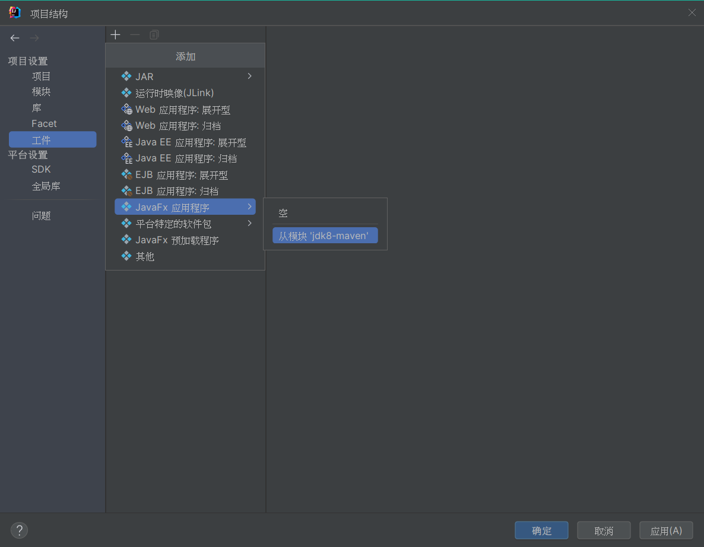
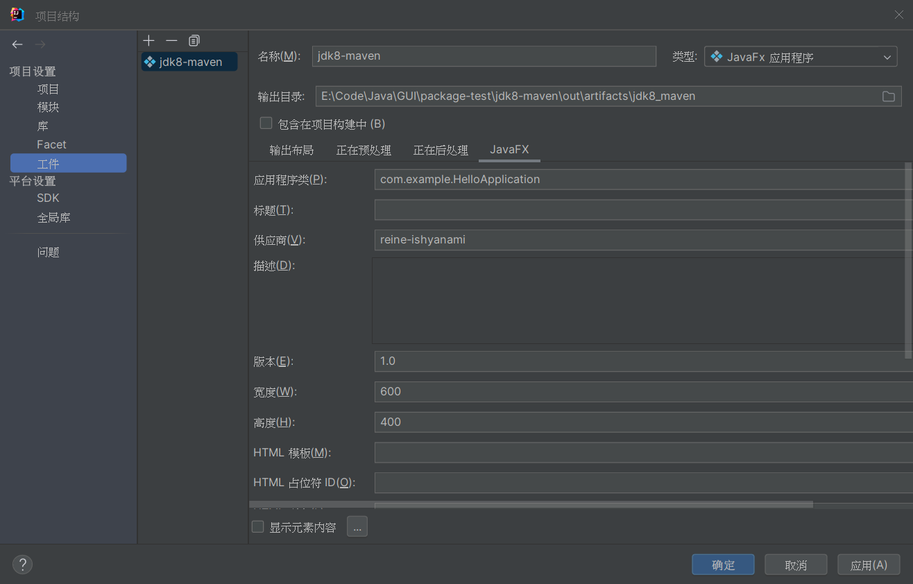
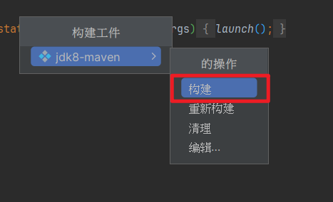

# JavaFX项目构建为可执行文件

**以下的jdk版本要求仅对于lts版本的jdk，其他版本的jdk中如果有对应的可执行程序，亦可成功运行**

## 1. javafxpackager

> 版本要求: oracle jdk8
> 
> 项目类型: 对于任意类型项目

1. 用IDEA打开项目，按下`ctrl+shift+alt+S`快捷键，进入项目结构窗口

2. 点击`项目设置 -> 工件`

3. 点击`+`号，如下图所示



4. 填写必要的参数
    * 应用程序类
    * 供应商
    * 版本
    * 宽度
    * 高度
    * 原生捆绑包
    * 应用程序图标



5. 构建




6. 构建完成后可在项目目录下的out文件夹找到对应的`exe`文件

## 2. JavaPackager

> 版本要求: 任意java版本
> 
> 项目类型: 仅对maven或gradle项目

**插件主页[JavaPackager](https://github.com/fvarrui/JavaPackager)**

1. windows需要安装[innosetup](https://jrsoftware.org/isinfo.php)和[wixtoolset v3](https://wixtoolset.org/), 推荐使用包管理器
`Chocolatey`或`Scoop`进行安装

    * [Chocolatey](https://chocolatey.org/install)
    ```shell
    choco install -y innosetup wixtoolset
    ```

    * [Scoop](https://scoop.sh/)
    ```shell
    scoop bucket add extras
    scoop install inno-setup
    scoop install wixtoolset
    ```

    * 如果手动安装innosetup和wixtoolset，则需要将`innosetup(iscc)`和`wixtoolset(candle & light)`添加到环境变量中

2. 在项目中引入依赖项，只列出了部分配置，更多完整配置请参考插件仓库主页（不要使用1.7.3-1.7.5的版本）

### maven项目配置
1. `pom.xml`

    ```xml
    <project>
        ...
        <build>
            <plugins>
                ...
                <plugin>
                    <groupId>io.github.fvarrui</groupId>
                    <artifactId>javapackager</artifactId>
                    <!--1.7.3-1.7.5在使用light指令时有bug-->
                    <version>1.7.2</version>
                    <executions>
                        <execution>
                            <phase>package</phase>
                            <goals>
                                <goal>package</goal>
                            </goals>
                            <configuration>
                                <mainClass>com.example.HelloApplication</mainClass>
                                <!-- optional -->
                                <bundleJre>true</bundleJre>
                                <customizedJre>false</customizedJre>
                                <generateInstaller>true</generateInstaller>
                                <administratorRequired>false</administratorRequired>
                                <platform>windows</platform>
                                <!--jre路径，如果没有jre时须填写jdkPath-->
                                <jrePath>E:\DevelopEnvironment\JDK\jdk1.8.0_301\jre</jrePath>
                                <winConfig>
                                    <!--应用图标-->
                                    <icoFile>${project.basedir}/src/main/resources/image/favicon.ico</icoFile>
                                    <generateSetup>true</generateSetup>
                                    <generateMsi>true</generateMsi>
                                    <generateMsm>true</generateMsm>
                                    <headerType>gui</headerType>
                                    <setupMode>askTheUser</setupMode>
                                    <companyName>reine-ishyanami</companyName>
                                    <!--可由用户自主选择要安装的路径-->
                                    <disableDirPage>false</disableDirPage>
                                </winConfig>
                            </configuration>
                        </execution>
                    </executions>
                </plugin>
            </plugins>
        </build>
    </project>
    ```

2. 构建
    
    ```shell
    mvn package
    ```
    
### gradle项目配置

1. `build.gradle`

    ```groovy
    import io.github.fvarrui.javapackager.gradle.PackageTask

    buildscript {
        repositories {
            mavenCentral()
        }
        dependencies {
            classpath 'io.github.fvarrui:javapackager:1.7.2'
        }
    }

    ...

    apply plugin: 'io.github.fvarrui.javapackager.plugin'

    ...

    task packageMyApp(type: PackageTask, dependsOn: build) {
        // mandatory
        mainClass = 'com.example.HelloApplication'
        // optional
        bundleJre = true
        customizedJre = false
        generateInstaller = true
        administratorRequired = false
        platform = "windows"
        jrePath = file("E:\\DevelopEnvironment\\JDK\\jdk1.8.0_301\\jre")
        winConfig {
            icoFile = file("${projectDir}/src/main/resources/image/favicon.ico")
            generateSetup = true
            generateMsi = true
            generateMsm = true
            disableDirPage = false
            headerType = "gui"
            setupMode = "askTheUser"
            companyName = "reine-ishyanami"
        }
    }
    ```

2. 构建

    ```shell
    gradle packageMyApp
    ```

## 3. jpackage

> 版本要求: jdk17以上，非lts版本最低为14，需要安装wixtoolset3.0，并将其工具包（light，candle）添加到环境变量
> 
> 项目类型: 对于任意类型项目，但推荐使用构建工具（如maven或gradle）

### maven项目配置

**更多配置参考[javafx-maven-plugin](https://github.com/openjfx/javafx-maven-plugin)**

1. IDEA中选择JavaFX项目maven创建项目，`pom.xml`默认会添加

    ```xml
    <!--以及javafx依赖-->
    <plugin>
        <groupId>org.openjfx</groupId>
        <artifactId>javafx-maven-plugin</artifactId>
        <version>0.0.8</version>
        <executions>
            <execution>
                <!-- Default configuration for running with: mvn clean javafx:run -->
                <id>default-cli</id>
                <configuration>
                    <mainClass>com.example/com.example.HelloApplication</mainClass>
                    <launcher>app</launcher>
                    <jlinkZipName>app</jlinkZipName>
                    <jlinkImageName>app</jlinkImageName>
                    <noManPages>true</noManPages>
                    <stripDebug>true</stripDebug>
                    <noHeaderFiles>true</noHeaderFiles>
                </configuration>
            </execution>
        </executions>
    </plugin>
    ```

2. 构建

    ```shell
    mvn javafx:jlink
    ```

3. 在项目目录下使用下面命令进行`jpackage`打包，只列出了部分参数，其他参数可以使用`jpackage -h`查看

    ```bat
    jpackage ^
        --name jdk17-jpackage ^
        --icon .\target\classes\image\favicon.ico ^
        --type app-image ^
        -m com.example/com.example.HelloApplication ^
        --runtime-image .\target\app\ ^
        --dest .\target\jpackage\
    ```

### gradle项目配置

**更多配置参考[jlink plugin](https://badass-jlink-plugin.beryx.org/releases/latest/)**

**注意：version字段只能包含数字和.**

1. IDEA中选择JavaFX项目gradle创建项目，`build.gradle`中添加，如果原来的文件中存在则可以忽略

    ```groovy
    plugins {
        ...
        id 'org.javamodularity.moduleplugin' version '1.8.12'
        id 'org.openjfx.javafxplugin' version '0.0.13'
        id 'org.beryx.jlink' version '2.25.0'
    }

    application {
        mainModule = 'com.example'
        mainClass = 'com.example.HelloApplication'
    }

    javafx {
        version = '17.0.6'
        modules = ['javafx.controls', 'javafx.fxml']
    }

    jlink {
        imageZip = project.file("${buildDir}/distributions/app-${javafx.platform.classifier}.zip")
        options = ['--strip-debug', '--compress', '2', '--no-header-files', '--no-man-pages']
        launcher {
            name = 'app'
            noConsole = true // 后面加上的
        }
        // 下面jpackage的闭包也是后面加上的
        jpackage {
            icon = project.file("${buildDir}/resources/main/image/favicon.ico")
            imageName = 'app'
            vendor = 'reine-ishyanami'
            if (org.gradle.internal.os.OperatingSystem.current().windows) {
                installerOptions += ['--win-per-user-install', '--win-dir-chooser', '--win-menu', '--win-shortcut', '--win-menu-group', 'app']
            }
        }
    }

    jlinkZip {
        group = 'distribution'
    }
    ```

2. 构建

    ```shell
    gradle jpackage
    ```

3. 在`build/jpackage`文件夹中可以找到生成的exe和msi文件


## 4. native-image


> 版本要求: graalvm jdk17
> 
> 项目类型: 仅对maven或gradle项目

[移步链接](./graalvmNative.md)