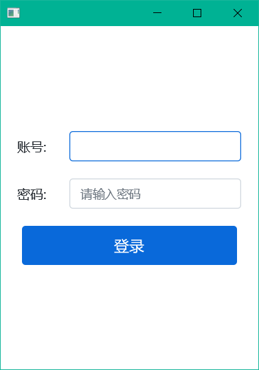
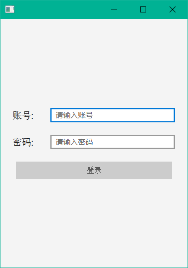
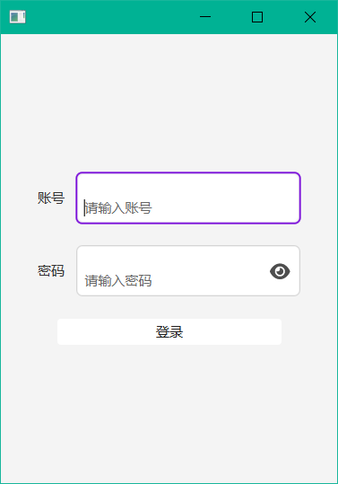

# 几种常用的JavaFX组件库或样式

## AtlantaFX

> Modern JavaFX CSS theme collection with additional controls.

* [仓库主页](https://github.com/mkpaz/atlantafx)

* [使用文档](https://mkpaz.github.io/atlantafx/reference/controls/)

### 示例代码

1. 引入依赖

    ```xml
    <dependency>
        <groupId>io.github.mkpaz</groupId>
        <artifactId>atlantafx-base</artifactId>
        <version>2.0.0</version>
    </dependency>    
    ```

2. 引入模块，在`module-info.java`中声明下列语句

    ```java
    requires atlantafx.base;
    ```

3. 主程序代码

    ```java
    public class AtlantaFXSample extends Application {
        @Override
        public void start(Stage primaryStage) throws Exception {
            // 使用样式
            Application.setUserAgentStylesheet(new PrimerLight().getUserAgentStylesheet());

            VBox root = new VBox(20);
            root.setAlignment(Pos.CENTER);

            HBox accountBox = new HBox(10);
            accountBox.setAlignment(Pos.CENTER);
            Label accountLabel = new Label("账号: ");
            accountLabel.setStyle("-fx-pref-width: 50; -fx-font-size: 15");
            TextField accountField = new TextField();
            accountField.setPromptText("请输入账号");
            accountField.setStyle("-fx-pref-width: 200");
            accountBox.getChildren().addAll(accountLabel, accountField);

            HBox passwordBox = new HBox(10);
            passwordBox.setAlignment(Pos.CENTER);
            Label passwordLabel = new Label("密码: ");
            passwordLabel.setStyle("-fx-pref-width: 50; -fx-font-size: 15");
            PasswordTextField passwordFiled = new PasswordTextField();
            passwordFiled.setPromptText("请输入密码");
            passwordFiled.setStyle("-fx-pref-width: 200");
            passwordBox.getChildren().addAll(passwordLabel, passwordFiled);

            Button button = new Button("登录");
            button.setStyle("-fx-pref-width: 250");
            // 设置样式类名
            button.getStyleClass().addAll("accent", "large");

            root.getChildren().addAll(accountBox, passwordBox, button);

            Scene scene = new Scene(root, 300, 400);

            primaryStage.setScene(scene);
            primaryStage.show();
        }
    }    
    ```

4. 效果
    



## JMetro

> JavaFX themes / styles that can be used to give applications a different look and feel.

* [仓库主页](https://github.com/JFXtras/jfxtras-styles)

### 示例代码

1. 引入依赖

    ```xml
    <dependency>
        <groupId>org.jfxtras</groupId>
        <artifactId>jmetro</artifactId>
        <version>11.6.16</version>
        <exclusions>
            <exclusion>
                <groupId>org.openjfx</groupId>
                <artifactId>javafx-graphics</artifactId>
            </exclusion>
        </exclusions>
    </dependency>

    <!--引入对应版本的graphics包-->
    <dependency>
        <groupId>org.openjfx</groupId>
        <artifactId>javafx-graphics</artifactId>
        <version>${jfx.version}</version>
    </dependency>    
    ```

2. 引入模块，在`module-info.java`中声明下列语句

    ```java
    requires org.jfxtras.styles.jmetro;
    ```

3. 主程序代码

    ```java
    public class JMetroSample extends Application {
        @Override
        public void start(Stage primaryStage) throws Exception {
            System.setProperty("prism.lcdtext", "false");// 可以不加

            VBox root = new VBox(20);
            root.setAlignment(Pos.CENTER);

            HBox accountBox = new HBox(10);
            accountBox.setAlignment(Pos.CENTER);
            Label accountLabel = new Label("账号: ");
            accountLabel.setStyle("-fx-pref-width: 50; -fx-font-size: 15");
            TextField accountField = new TextField();
            accountField.setPromptText("请输入账号");
            accountField.setStyle("-fx-pref-width: 200");
            accountBox.getChildren().addAll(accountLabel, accountField);

            HBox passwordBox = new HBox(10);
            passwordBox.setAlignment(Pos.CENTER);
            Label passwordLabel = new Label("密码: ");
            passwordLabel.setStyle("-fx-pref-width: 50; -fx-font-size: 15");
            PasswordField passwordFiled = new PasswordField();
            passwordFiled.setPromptText("请输入密码");
            passwordFiled.setStyle("-fx-pref-width: 200");
            passwordBox.getChildren().addAll(passwordLabel, passwordFiled);


            Button button = new Button("登录");
            button.setStyle("-fx-pref-width: 250");

            root.getChildren().addAll(accountBox, passwordBox, button);
            Scene scene = new Scene(root, 300, 400);
            JMetro jMetro = new JMetro(scene, Style.LIGHT); // 引入样式
            primaryStage.setScene(scene);
            primaryStage.show();
        }
    }    
    ```

4. 效果



## MaterialFX

> A library of material components for JavaFX

* [仓库主页](https://github.com/palexdev/MaterialFX)

* [使用文档](https://github.com/palexdev/MaterialFX/wiki)

### 示例代码

1. 引入依赖

    ```xml
    <dependency>
        <groupId>io.github.palexdev</groupId>
        <artifactId>materialfx</artifactId>
        <version>11.17.0</version>
    </dependency>    
    ```

2. 引入模块，在`module-info.java`中声明下列语句

    ```java
    requires MaterialFX;
    ```

3. 主程序代码

    ```java
    public class MaterialFXSample extends Application {
        @Override
        public void start(Stage primaryStage) throws Exception {
            // 引入样式
            UserAgentBuilder.builder()
                    .themes(JavaFXThemes.MODENA)
                    .themes(MaterialFXStylesheets.forAssemble(true))
                    .setDeploy(true)
                    .setResolveAssets(true)
                    .build()
                    .setGlobal();

            VBox root = new VBox(20);
            root.setAlignment(Pos.CENTER);

            HBox accountBox = new HBox(10);
            accountBox.setAlignment(Pos.CENTER);
            Label accountLabel = new Label("账号");
            MFXTextField accountField = new MFXTextField();
            accountField.setPromptText("请输入账号");
            accountField.setStyle("-fx-pref-width: 200; -fx-pref-height: 10");
            accountBox.getChildren().addAll(accountLabel, accountField);

            HBox passwordBox = new HBox(10);
            passwordBox.setAlignment(Pos.CENTER);
            Label passwordLabel = new Label("密码");
            MFXPasswordField passwordFiled = new MFXPasswordField();
            passwordFiled.setPromptText("请输入密码");
            passwordFiled.setStyle("-fx-pref-width: 200;-fx-pref-height: 10");
            passwordBox.getChildren().addAll(passwordLabel, passwordFiled);


            MFXButton button = new MFXButton("登录");
            button.setStyle("-fx-pref-width: 200");

            root.getChildren().addAll(accountBox, passwordBox, button);
            Scene scene = new Scene(root, 300, 400);
            primaryStage.setScene(scene);
            primaryStage.show();

        }
    }

    ```

4. 效果

