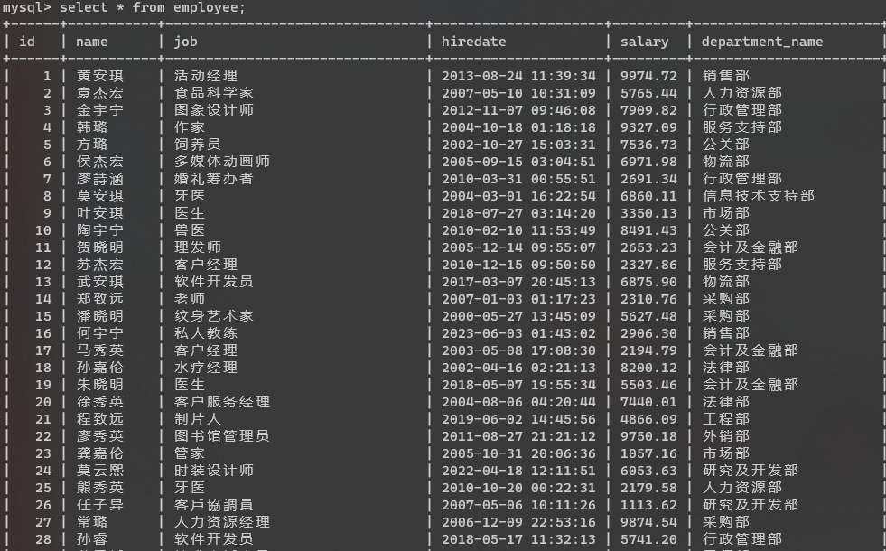
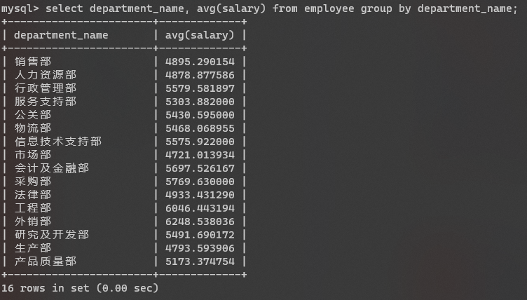
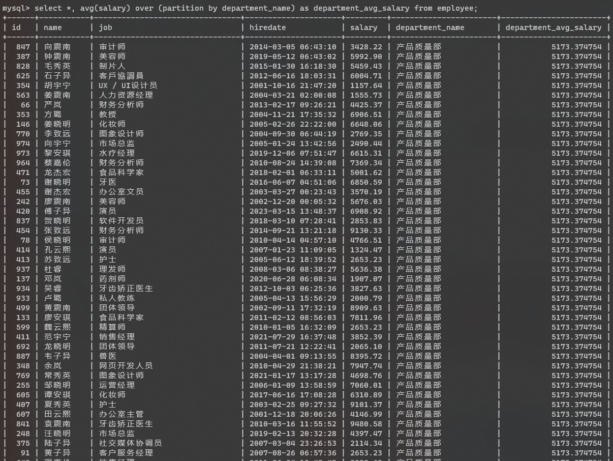
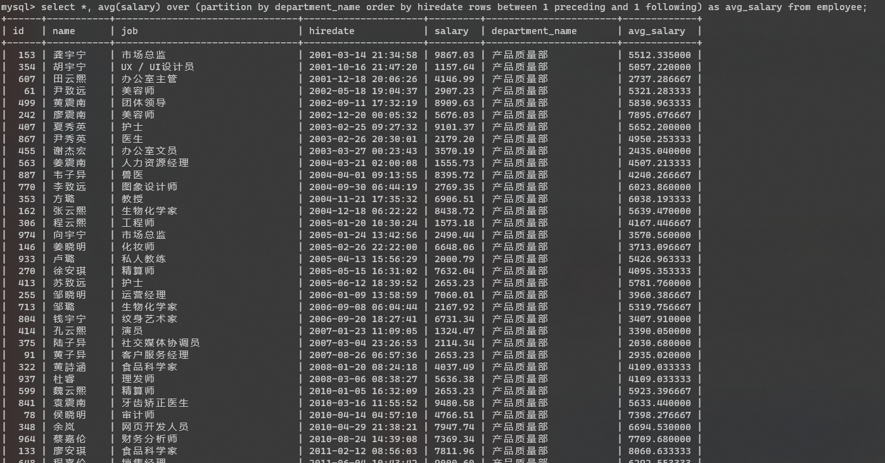
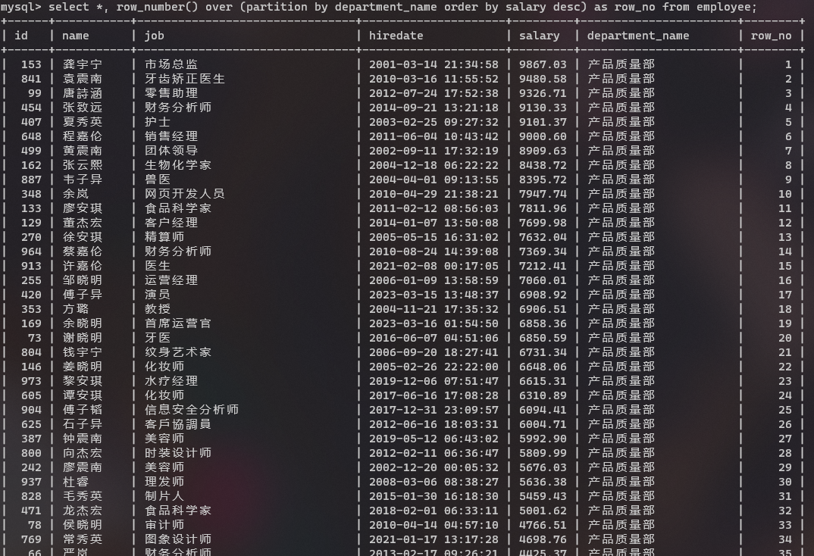
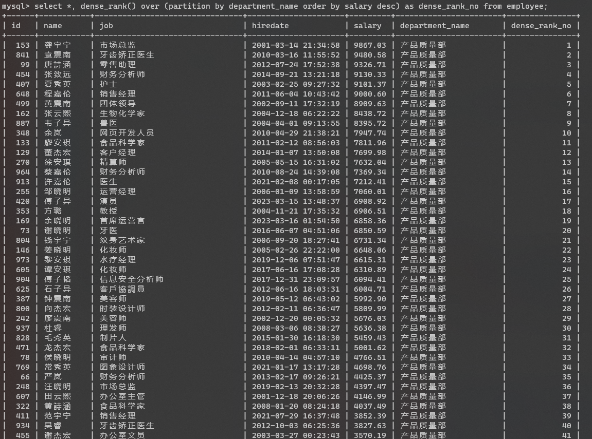
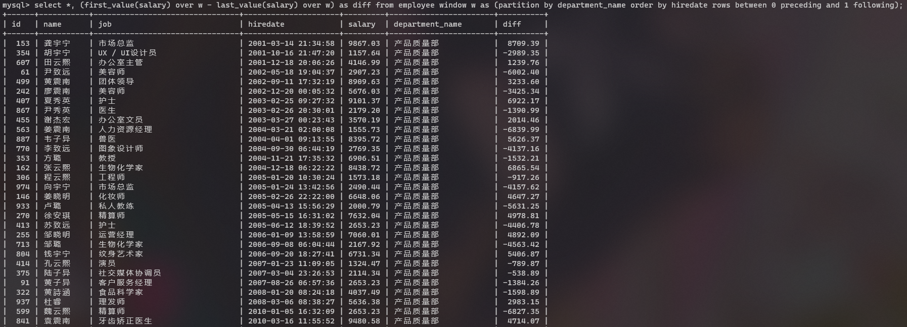

# MySQL开窗函数

开窗函数是在MySQL8.0以后才新加的功能，因此，要想直接使用开窗函数，则sql版本要8.0以上。其实开窗函数是在满足某种条件的记录集合上执行的特殊函数。对于每条记录都要在此窗口内执行函数，有的函数随着记录不同，窗口大小都是固定的，这种属于静态窗口；有的函数则相反，不同的记录对应着不同的窗口，这种动态变化的窗口叫滑动窗口。开窗函数的本质还是聚合运算，只不过它更具灵活性，它对数据的每一行，都使用与该行相关的行进行计算并返回计算结果。其具体语法如下：


`开窗函数名([<字段名>]) over([partition by <分组字段>] [order by <排序字段> [desc]] [<细分窗口>])`

* partition by子句：按照指定字段进行分区，两个分区由边界分隔，开窗函数在不同的分区内分别执行，在跨越分区边界时重新初始化。
* order by子句：按照指定字段进行排序，开窗函数将按照排序后的记录顺序进行编号。可以和partition by子句配合使用，也可以单独使用。
* frame子句：当前分区的一个子集，用来定义子集的规则，通常用来作为滑动窗口使用。


## 案例说明
[相关数据库表文件](https://github.com/reine-ishyanami/blog/blob/master/code/employee.sql)

#### 表数据概览



#### 统计每个部门的平均工资
```sql
select department_name,
       avg(salary)
from employee
group by department_name;
```



#### 为每一位员工附加部门的平均工资
```sql
select *,
       avg(salary)
           over (partition by department_name)
           as department_avg_salary
from employee;
```



#### 按入司时间降序统计每个部门员工的工资累加值
```sql
select *,
       sum(salary)
           over (partition by department_name order by hiredate desc)
           as sum_salary
from employee;
```


#### 按入司时间升序统计相邻两个员工的平均工资
```sql
select *,
       avg(salary)
           over (partition by department_name order by hiredate rows between 1 preceding and 1 following)
           as avg_salary
from employee;
```



#### 分析每个部门按工资降序的记录行号
```sql
select *,
       row_number()
               over (partition by department_name order by salary desc)
           as row_no
from employee;
```



#### 分析每个部门按工资降序的员工排名，跳跃排名（即按1，1，3，4这样的排名）
```sql
select *,
       rank()
               over (partition by department_name order by salary desc)
           as rank_no
from employee;
```


#### 分析每个部门按工资降序的员工排名，连续排名（即按1，1，2，3这样的排名）
```sql
select *,
       dense_rank()
               over (partition by department_name order by salary desc)
           as dense_rank_no
from employee;
```



#### 分析每个窗口按入司时间升序与次位薪资差
```sql
-- 分析每个窗口按入司时间升序与次位薪资差
select *,
  (first_value(salary) over w - last_value(salary) over w) as diff 
from employee 
window w as (partition by department_name order by hiredate rows between 0 preceding and 1 following);
```



#### 查询每个部门工资第二高的员工姓名
```sql
select *
from (select *,
             rank() over (partition by department_name order by salary desc) as rank_no
      from employee) as emp
where rank_no = 2;
```

