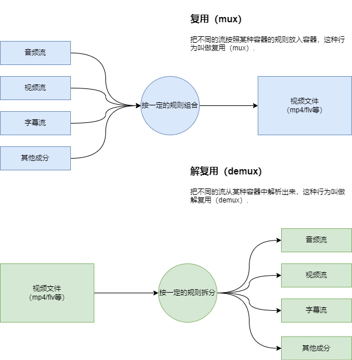
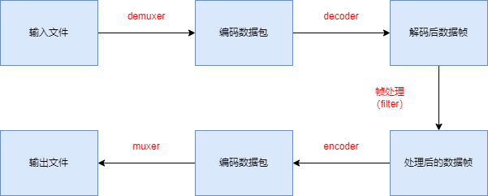
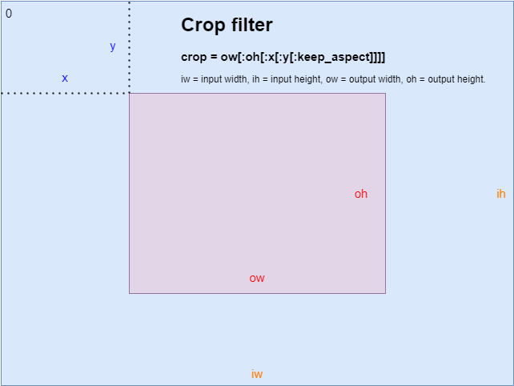

# FFmpeg

## 基础知识

1.  容器/文件(Conainer/File)：即特定格式的多媒体文件，比如mp4、flv、mkv等。 
2.  媒体流（Stream）：表示时间轴上的一段连续数据，如一段声音数据、一段视频数据或一段字幕数据，可以是压缩的，也可以是非压缩的，压缩的数据需要关联特定的编解码器。 
3.  数据帧/数据包(Frame/Packet)：通常，一个媒体流是由大量的数据帧组成的，对于压缩数据，帧对应着编解码器的最小处理单元，分属于不同媒体流的数据帧交错存储于容器之中。 

> 一般情况下：
>  
> Frame对应压缩前的数据，Packet对应压缩后的数据。


4. 编解码器(Codec)：以帧为单位实现压缩数据和原始数据之间的相互转换的


5.  复用(mux)：把不同的流按照某种容器的规则放入容器，这种行为叫做复用（mux） 
6.  解复用(mux)：把不同的流从某种容器中解析出来，这种行为叫做解复用(demux) 



7.  码率和帧率是视频文件的最重要的基本特征，对于他们的特有设置会决定视频质量。如果我们知道码率和时长那么可以很容易计算出输出文件的大小。 
8.  帧率：帧率也叫帧频率，帧率是视频文件中每一秒的帧数，肉眼想看到连续移动图像至少需要15帧。 
9.  码率：比特率(也叫码率，数据率)是一个确定整体视频/音频质量的参数，秒为单位处理的位数，码率和视频质量成正比，在视频文件中中比特率用bps来表达。 

## ffmpeg



```shell
ffmpeg -i test_1920x1080.mp4 -acodec copy -vcodec libx264 -s 1280x720 test_1280x720.flv
```

### ffmpeg命令分类
| 命令参数 | 内容 |
| --- | --- |
| -version | 显示版本 |
| -buildconf | 显示编译配置 |
| -formats | 显示可用格式（muxers + demuxers） |
| -muxers | 显示可用复用器 |
| -demuxers | 显示可用解复用器 |
| -codecs | 显示可用编解码器（decoders + encoders） |
| -decoders | 显示可用解码器 |
| -encoders | 显示可用编码器 |
| -bsfs | 显示可用比特流（filter） |
| -protocols | 显示可用的协议 |
| -filters | 显示可用的过滤器 |
| -pix_fmts | 显示可用的像素格式 |
| -layouts | 显示标志声道名称 |
| -sample_fmts | 显示可用的音频采样格式 |
| -colors | 显示可用的颜色名称 |


查看具体分类所支持的参数

```shell
ffmpeg -h type=name
```

比如

```shell
ffmpeg -h muxer=flv
ffmpeg -h filter=atempo
ffmpeg -h encoder=libx264
```

### ffmpeg命令参数说明
| 参数 | 说明 |
| --- | --- |
| -i | 指定输入流 |
| -f | 设定输出格式（format） |
| -ss | 开始时间 |
| -t | 时间长度 |
| -aframes | 设置要输出的音频频数 |
| -b:a | 音频码率 |
| -ar | 设定采样率 |
| -ac | 设定声音的Channel数 |
| -acodec | 设定声音编解码器，如果用copy表示原始编解码数据必须被拷贝 |
| -an | 不处理音频 |
| -af | 音频过滤器 |
| -vframes | 设置要输出的视频帧数 |
| -b | 设定视频码率 |
| -b:v | 视频码率 |
| -r | 设定帧速率 |
| -s | 设定画面的宽高 |
| -vn | 不处理视频 |
| -aspect aspect | 设置横纵比（如4:3, 16:9, 1.3333, 1.7777） |
| -vcodec | 设定视频编解码器，如果用copy表示原始编解码数据必须被拷贝 |
| -vf | 视频过滤器 |


### ffmpeg命令提取音视频数据

```shell
# 保留封装格式
ffmpeg -i test.mp4 -acodec copy -vn audio.mp4
ffmpeg -i test.mp4 -vcodec copy -an video.mp4

# 提取视频
# 保留编码格式
ffmpeg -i test.mp4 -vcodec copy -an test_copy.h264
# 强制格式
ffmpeg -i test.mp4 -vcodec libx264 -an test.h264

# 提取音频
# 保留编码格式
ffmpeg -i test.mp4 -acodec copy -vn test.aac
# 强制格式
ffmpeg -i test.mp4 -acodec libmp3lame -vn test.mp3
```

### ffmpeg命令提取像素格式

```shell
# 提取YUV
# 提取3s数据，分辨率和源视频一致
ffmpeg -i test_1280x720.mp4 -t 3 -pix_fmt yuv420p yuv420p_orig.yuv
# 提取3s数据，分辨率转为320x240
ffmpeg -i test_1280x720.mp4 -t 3 -pix_fmt yuv420p -s 320x240 yuv420p_320x240.yuv

# 提取RGB
# 提取3s数据，分辨率转为320x240
ffmpeg -i test.mp4 -t 3 -pix_fmt rgb24 -s 320x240 rgb24_320x240.rgb

# RGB与YUV之间的转换
ffmpeg -s 320x240 -pix_fmt yuv420p -i yuv420p_320x240.yuv -pix_fmt rgb24 rgb24_320x240_2.rgb
```

### ffmpeg命令提取PCM数据

```shell
# 提取PCM
ffmpeg -i buweishui.mp3 -ar 48000 -ac 2 -f s16le 48000_2_s16le.pcm # 输出文件后缀名随意
ffmpeg -i buweishui.mp3 -ar 48000 -ac 2 -sample_fmt s16 out_s16.wav
ffmpeg -i buweishui.mp3 -ar 48000 -ac 2 -codec:a pcm_s16le out2_s16le.wav
ffmpeg -i buweishui.mp3 -ar 48000 -ac 2 -f f32le 48000_2_f32le.pcm # 输出文件后缀名随意
```

### ffmpeg命令转封装

```shell
# 保持编码格式
ffmpeg -i test.mp4 -vcodec copy -acodec copy test_copy.ts
ffmpeg -i test.mp4 -codec copy test_copy2.ts

# 改变编码格式
ffmpeg -i test.mp4 -vcodec libx265 acodec libmp3lame out_h265_mp3.mkv

# 修改帧率
ffmpeg -i test.mp4 -r 15 output.mp4

# 修改视频码率
ffmpeg -i test.mp4 -b 400k output_b.mkv
ffmpeg -i test.mp4 -b:v 400k output_bv.flv

# 修改音频码率（如果不想重新编码video，需要加上-vcodec copy） 
ffmpeg -i test.mp4 -b:a 192k output_ba.mp4

# 修改音视频码率
ffmpeg -i test.mp4 -b:v 400k -b:a 192k output_bva.mp4

# 修改视频分辨率
ffmpeg -i test.mp4 -s 480x270 output_480x270.mp4

# 修改音频采样率
ffmpeg -i test.mp4 -ar 44100 output_44100hz.mp4
```

### ffmpeg命令截取与合并视频

```shell
# 截取视频
# 如果音视频格式不一致则强制统一为-vcodec libx264 -acodec aac
ffmpeg -i test1.mp4 -ss 00:05:00 -t 10 -codec copy 1.mp4
ffmpeg -i test2.mp4 -ss 00:05:00 -t 10 -codec copy 2.mp4
ffmpeg -i test3.mp4 -ss 00:05:00 -t 10 -codec copy 3.mp4

# 将上述处理结果转成ts格式
# 分离某些封装格式（例如mp4，flv，mkv等）中的H.264的时候，需要首先写入SPS和PPS，否则会导致分离出来的数据没用SPS、PPS而无法播放。H.264码流的SPS和PPS信息存储在AVCodecContext结构体的extradata中。需要使用ffmpeg中名称为“h264_mp4toannexb”的bitstream filter处理
ffmpeg -i 1.mp4 -codec copy -vbsf h264_mp4toannexb 1.ts
ffmpeg -i 2.mp4 -codec copy -vbsf h264_mp4toannexb 2.ts
ffmpeg -i 3.mp4 -codec copy -vbsf h264_mp4toannexb 3.ts

# 转成flv格式
ffmpeg -i 1.mp4 -codec copy 1.flv
ffmpeg -i 2.mp4 -codec copy 2.flv
ffmpeg -i 3.mp4 -codec copy 3.flv

# 以mp4格式进行拼接
ffmpeg -i "concat:1.mp4|2.mp4|3.mp4" -codec copy out_mp4.mp4 (异常)
ffmpeg -f concat -i mp4list.txt -codec copy out_mp4.mp4

# 以ts格式进行拼接
ffmpeg -i "concat:1.ts|2.ts|3.ts" -codec copy out_ts.mp4
ffmpeg -f concat -i tslist.txt -codec copy out_ts.mp4

# 以flv格式进行拼接
ffmpeg -i "concat:1.flv|2.flv|3.flv" -codec copy out_flv.mp4 (异常)
ffmpeg -f concat -i flvlist.txt -codec copy out_flv.mp4
```

mp4list.txt内容

```shell
file '1.mp4'
file '2.mp4'
file '3.mp4'
```

tslist.txt内容

```shell
file '1.ts'
file '2.ts'
file '3.ts'
```

flvlist.txt内容

```shell
file '1.flv'
file '2.flv'
file '3.flv'
```

> 注意事项
>  
> - 拼接时，视频分辨率可以不同，但编码格式需要统一
> - 音频编码格式需要统一，音频参数（采样率/声道等）也需要统一


### ffmpeg图片与视频转换

```shell
ffmpeg -i test.mp4 -y -f image2 -ss 00:00:02 -vframes 1 -s 640x360 test.jpg
ffmpeg -i test.mp4 -y -f image2 -ss 00:00:02 -vframes 1 -s 640x360 test.bmp
```

> -i 输入
-y 覆盖
-f 格式
image2 一种格式
-ss 起始值
-vframes 帧 如果大于1 那么 输出加%03d 如test%03d.jpg
-s 格式大小size


```shell
# 转换视频为图片（每帧一张图）
ffmpeg -i test.mp4 -t 5 -s 640x360 -r 15 frame%03d.jpg

# 图片转换为视频
ffmpeg -f image2 -i frame%03d.jpg -r 25 video.mp4

# 从视频中生成gif图片
ffmpeg -i test.mp4 -t 5 -r 1 image1.gif
ffmpeg -i test.mp4 -t 5 -r 25 -s 640x360 image2.gif

# 将gif转换为视频
ffmpeg -f gif -i image2.gif image2.mp4
```

### ffmpeg命令音视频录制

> 安装 dshow软件 [Screen Capturer Recorder](https://sourceforge.net/projects/screencapturer/files/)
>  
> 查看可用设备名`ffmpeg -list_devices true -f dshow -i dummy`


```shell
# 录制视频
# 录屏
ffmpeg -f dshow -i video="screen-capture-recorder" v-out.mp4
# 摄像（根据电脑摄像头名称）
ffmpeg -f dshow -i video="Integrated Camera" v-out.mp4 

# 录制声音（默认参数）
# 系统声音 
ffmpeg -f dshow -i audio="virtual-audio-capturer" a-out.aac
# 系统+麦克风声音（根据电脑麦克风名称）
ffmpeg -f dshow -i audio="麦克风阵列 (Realtek(R) Audio)" -f dshow -i audio="virtual-audio-capturer" -filter_complex amix=inputs=2:duration=first:dropout_transition=2 a-out2.aac

# 同时录制声音和视频（默认参数）
ffmpeg -f dshow -i audio="麦克风阵列 (Realtek(R) Audio)" -f dshow -i audio="virtual-audio-capturer" -filter_complex amix=inputs=2:duration=first:dropout_transition=2 -f dshow -i video="screen-capture-recorder" av-out.mp4 

# 查看视频录制的可选参数
ffmpeg -f dshow -list_options true -i video="screen-capture-recorder"
# 查看音频录制的可选参数
ffmpeg -f dshow -list_options true -i audio="virtual-audio-capturer"

# 指定参数录制音视频
ffmpeg -f dshow -i audio＝"麦克风阵列 (Realtek(R) Audio)" -f dshow -i audio="virtual-audio-capturer" -filter_complex amix=inputs=2:duration=first:dropout_transition=2 -f dshow -video_size 1920x1080 -framerate 15 -pixel_format yuv420p -i video="screen-capture-recorder" -vcodec h264_qsv -b:v 3M -y av-out.flv

ffmpeg -f dshow -i audio＝"麦克风阵列 (Realtek(R) Audio)" -f dshow -i audio="virtual-audio-capturer" -filter_complex amix=inputs=2:duration=first:dropout_transition=2 -f dshow -i o="screen-capture-recorder" -vcodec h264_qsv -b:v 3M -r 15 -y av-out.mp4
```

### ffmpeg直播

> 参考[Nginx搭建rtmp流媒体服务器](https://www.jianshu.com/p/16741e363a77)


```shell
# 拉流（对于不是rtmp的协议，-c copy要谨慎使用）
ffplay rtmp://server/live/streamName
ffmpeg -i rtmp://server/live/streamName -c copy dump.flv

# 推流
ffmpeg -re -i out.mp4 -c copy flv rtmp://server/live/streamName
```

### ffmpeg视频裁剪（crop）



```shell
ffmpeg -i input.jpg -vf crop=iw/3:ih:0:0 output.jpg
ffmpeg -i input.mp4 -vf crop=iw/3:ih:0:0 output.mp4
```

### ffmpeg文字水印（drawtext）
| 参数 | 类型 | 说明 |
| --- | --- | --- |
| text | 字符串 | 文字 |
| textfile | 文件路径 | 文字文件 |
| box | 布尔 | 文字区域背景框（缺省false） |
| boxcolor | 颜色 | 展示字体区域块的颜色 |
| font | 字体名称 | 字体名称（缺省Sans字体） |
| fontsize | 整数 | 字体大小 |
| x | 字符串 | 横坐标（缺省0） |
| y | 字符串 | 纵坐标（缺省0） |
| alpha | 浮点数 | 透明度（0~1，缺省0） |
| enable | 特殊表达式 | [表达式参考](http://www.ffmpeg.org/ffmpeg-utils.html#Expression-Evaluation) |


```shell
# 将文字的水印加在视频的左上角
ffplay -i input.mp4 -vf "drawtext=fontsize=100:fontfile=FreeSerif.ttf:text='Hello World':x=20:y=20"

# 绿色字体
ffplay -i input.mp4 -vf "drawtext=fontsize=100:fontfile=FreeSerif.ttf:text='Hello World':fontcolor=green"

# 修改透明度
ffplay -i input.mp4 -vf "drawtext=fontsize=100:fontfile=FreeSerif.ttf:text='Hello 
World':fontcolor=green:alpha=0.5"

# 边框及边框颜色
ffplay -i input.mp4 -vf "drawtext=fontsize=100:fontfile=FreeSerif.ttf:text='Hello World':fontcolor=green:alpha=0.5:box=1:boxcolor=yellow"

# 将本地时间作为水印内容
ffplay -i input.mp4 -vf "drawtext=fontsize=100:fontfile=FreeSerif.ttf:text='%{localtime\:%Y\-%m\-%d %H-%M-%S}':fontcolor=green:alpha=0.5:box=1:boxcolor=yellow"

# 在使用ffmpeg转码存储到文件时需要加上-re，否则时间不对
ffmpeg -re -i input.mp4 -vf "drawtext=fontsize=100:fontfile=FreeSerif.ttf:text='%{localtime\:%Y\-%m\-%d %H-%M-%S}':fontcolor=green:alpha=0.5:box=1:boxcolor=yellow"

# 定时显示水印
ffplay -i input.mp4 -vf "drawtext=fontsize=100:fontfile=FreeSerif.ttf:text='test':fontcolor=green:alpha=0.5:enable=lt(mod(t\,3)\,1)"

# 水印跑马灯效果
ffplay -i input.mp4 -vf "drawtext=fontsize=100:fontfile=FreeSerif.ttf:text='test':fontcolor=green:alpha=0.5:x=mod(100*t\,w):y=abs(sin(t))*h*0.7"
```

### ffmpeg图片水印（movie）
| 参数 | 类型 | 说明 |
| --- | --- | --- |
| filename | 字符串 | 输入的文件名，可以是文件，协议，设备 |
| format_name, f | 字符串 | 输入的封装格式 |
| stream_index, si | 整数 | 输入的流索引编号 |
| seek_point, sp | 浮点数 | Seek输入流的时间位置 |
| streams, s | 字符串 | 输入的多个流的流信息 |
| loop | 整数 | 循环次数 |
| discontinuity | 时间差值 | 支持跳动的时间戳差值 |


```shell
ffmpeg -i input.mp4 -vf "movie=logo.png[watermark];[in][watermark]overlay=x=10:y=10[out]" output.mp4
```

> 原始视频文件路径：input.mp4
>  
> 水印图片路径：logo.png
>  
> 水印位置：(x, y) = (10, 10) <= (left, top) 距离左侧、顶部各10像素
>  
> 输出文件路径：output.mp4

| 参数 | 说明 |
| --- | --- |
| main_w | 视频单帧图像宽度 |
| main_h | 视频单帧图像高度 |
| overlay_w | 水印图片的宽度 |
| overlay_h | 水印图片的高度 |


水印图片位置与对于参数值

| 水印图片位置 | overlay值 |
| --- | --- |
| 左上角 | 10:10 |
| 右上角 | main_w-overlay_w-10:10 |
| 左下角 | 10:main_h-overlay_h-10 |
| 右下角 | main_w-overlay_w-10:main_h-overlay_h-10 |


```shell
ffplay -i input.mp4 -vf "movie=logo.png[watermark];[in][watermark]overlay=x=mod(50*t\,main_w):y=abs(sin(t))*h*0.7[out]"
```

### ffmpeg画中画
| 参数 | 类型 | 说明 |
| --- | --- | --- |
| x | 字符串 | 横坐标 |
| y | 字符串 | 纵坐标 |
| eof_action | 整数 | 遇到eof表示时的处理方式，默认为重复 
_ repeat（值为0）【重复前一帧】
_ endcall（值为1）【停止所有的流】
* pass（值为2）【保留主图层】 |
| shortest | 布尔 | 终止最短的视频时全部终止（缺省false） |
| format | 整数 | 设置output的像素格式，缺省yuv420
_ yuv420（值为0）
_ yuv422（值为1）
_ yuv444（值为2）
_ rgb（值为3） |


```shell
# 显示画中画效果
ffplay -i input.mp4 -vf "movie=sub_320x240.mp4[sub];[in][sub]overlay=x=20:y=20[out]"
ffplay -i input.mp4 -vf "movie=sub_320x240.mp4[sub];[in][sub]overlay=x=20:y=20:eof_action=1[out]"
ffplay -i input.mp4 -vf "movie=sub_320x240.mp4[sub];[in][sub]overlay=x=20:y=20:shortest=1[out]"

# 缩放子画面尺寸
ffplay -i input.mp4 -vf "movie=sub_320x240.mp4,scale=160x120[sub];[in][sub]overlay=x=20:y=20[out]"

# 跑马灯
ffplay -i input.mp4 -vf "movie=sub_320x240.mp4,scale=160x120[sub];[in][sub]overlay=x=mod(50*t\,main_w):y=abs(sin(t))*h*0.7[out]"
```

### ffmpeg视频多宫格处理

```shell
ffmpeg -i 1.mp4 -i 1.mp4 -i 1.mp4 -i 1.mp4 -filter_complex "nullsrc=size=640x480[base];[0:v]setpts=PTS-STARTPTS,scale=320x240[upperleft];[1:v]setpts=PTS-STARTPTS,scale=320x240[upperright];[2:v]setpts=PTS-STARTPTS,scale=320x240[lowerleft];[3:v]setpts=PTS-STARTPTS,scale=320x240[lowerright];[base][upperleft]overlay=shortest=1[tmp1];[tmp1][upperright]overlay=shortest=1:x=320[tmp2];[tmp2][lowerleft]overlay=shortest=1:y=240[tmp3];[tmp3][lowerright]overlay=shortest=1:x=320:y=240" out.mp4
```

## ffplay

### ffplay播放控制
| 选项 | 说明 |
| --- | --- |
| q, ESC | 退出播放 |
| f | 全屏切换 |
| p, SPACE | 暂停 |
| m | 静音切换 |
| 9, 0 | 9减少音量，0增加音量 |
| a | 循环切换音频流 |
| v | 循环切换视频流 |
| t | 循环切换字幕流 |
| c | 循环切换节目 |
| w | 循环切换过滤器或显示模式 |
| s | 逐帧播放 |
| LEFT, RIGHT | 快退、快进10s |
| DOWN, UP | 快退、快进1m |


### ffplay命令选项
| 选项 | 说明 |
| --- | --- |
| -x width | 强制指定宽度 |
| -y height | 强制指定高度 |
| -video_size size | 帧尺寸，设置显示帧存储（WxH）格式 |
| -pixel_format format | 格式设置像素格式 |
| -fx | 以全屏模式启动 |
| -an | 禁用音频 |
| -vn | 禁用视频 |
| -sn | 禁用字幕 |
| -ss pos | 指定播放开始时间 |
| -t duration | 设置播放时长 |
| -bytes | 按字节进行定位拖动（0=off 1=on -1=auto） |
| -seek_interval interval | 自定义快进快退时间，默认为10s |
| -nodisp | 关闭图形化显示窗口，不显示视频 |
| -noborder | 无边框窗口 |
| -volume vol | 设置起始音量，范围【0~100】 |
| -f fmt | 强制使用设置的格式进行解析，如-f s16le |
| -window_title title | 设置窗口标题（默认为输入文件名） |
| -loop number | 设置播放循环次数 |
| -showmode mode | 设置显示模式（0视频（缺省），1音频波形，2音频频谱（视频不存在缺省）） |
| -vf filtergraph | 设置视频滤镜 |
| -af filtergraph | 设置音频滤镜 |
| -stats | 打印多个回放统计时间，包括显示流持续时间，编解码器参数，流中的当前位置，以及音频/视频同步差值。默认情况下处于启用状态，要显式禁用它则需要指定-nostats |
| -fast | 非标准化规范的多媒体兼容优化 |
| -genpts | 生成pts |
| -sync type | 同步类型 将主时钟设置为audio（type=audio），video（type=video）或external（type=ext），默认是audio为主时钟 |
| -ast audio_stream_specifier | 指定音频流索引，比如-ast 3，播放流索引为3的音频流 |
| -vst video_stream_specifier | 指定视频流索引，比如-vst 4，播放流索引为4的视频流 |
| -sst subtitle_stream_specifier | 指定字幕流索引，比如-sst 5，播放流索引为5的字幕流 |
| -autoexit | 视频播放完毕自动退出 |
| -exitnokeydown | 按下键盘任意按键退出播放 |
| -exitonmousedown | 按下鼠标任意按键退出播放 |
| -codec:media_specifier codec_name | 强制使用设置的多媒体解码器，media_specifier可用值为a（音频），v（视频）和s（字幕）。比如-codec:v h264_qsv 强制视频采用h264_qsv强制视频采用h264_qsv解码 |
| -acodec codec_name | 强制使用设置的音频解码器进行音频解码 |
| -vcodec codec_name | 强制使用设置的视频解码器进行视频解码 |
| -scodec codec_name | 强制使用设置的字幕解码器进行字幕解码 |
| -autorotate | 根据文件元数据自动选择视频。值为0或1，默认为1 |
| -framedrop | 如果视频不同步则丢弃视频帧。当主时钟非视频时钟时默认开启。若需禁用则使用-noframedrop |
| -infbuf | 不限制输入缓冲区大小，尽可能快地从输入中读取尽可能多的数据。播放实时流时默认启用，如果未及时读取数据，则可能会丢弃数据。此选项将不限制缓冲区的大小。若需禁用则使用-noinfbuf |


### ffplay命令播放

```shell
# 播放本地文件
ffplay -window_title "test name" -ss 2 -t 10 -autoexit test.mp4
ffplay buweishui.mp4

# 播放网络流
ffplay -window_title "rtmp stream" rtmp://202.69.69.180:443/webcast/bshdlive-pc

# 强制解码器
# mpeg4解码器 
ffplay -vcodec mpeg4 test.mp4
# h264解码器
ffplay -vcodec h264 test.mp4

# 禁用音频
ffplay test.mp4 -an

# 禁用视频
ffplay test.mp4 -vn

# 播放YUV数据
ffplay -pixel_format yuv420p -video_size 320x240 -framerate 5 yuv420p_320x240.yuv

# 播放RGB数据
ffplay -pixel_format rgb24 -video_size 320x240 -i rgb24_320x240.rgb
ffplay -pixel_format rgb24 -video_size 320x240 -framerate 5 -i rgb24_320x240.rgb

# 播放PCM数据
ffplay -ar 48000 -ac 2 -f f32le 48000_2_f32e.pcm
-ar set audio sampling rate(in Hz)(from 0 to INT_MAX)(default 0)
-ac set audio number of audio channels(from 0 to INT_MAX)(default 0)
```

### ffplay简单过滤器

```shell
# 视频旋转
ffplay -i test.mp4 -vf transpose=1
# 视频反转
ffplay test.mp4 -vf hflip
ffplay test.mp4 -vf vflip
# 视频旋转和反转
ffplay test.mp4 -vf hflip,transpose=1
# 音频变速播放
ffplay -i test.mp4 -af atempo=2
# 视频变速播放
ffplay -i test.mp4 -vf setpts=PTS/2
# 音视频同时变速
ffplay -i test.mp4 -vf setpts=PTS/2 -af atempo=2
```
